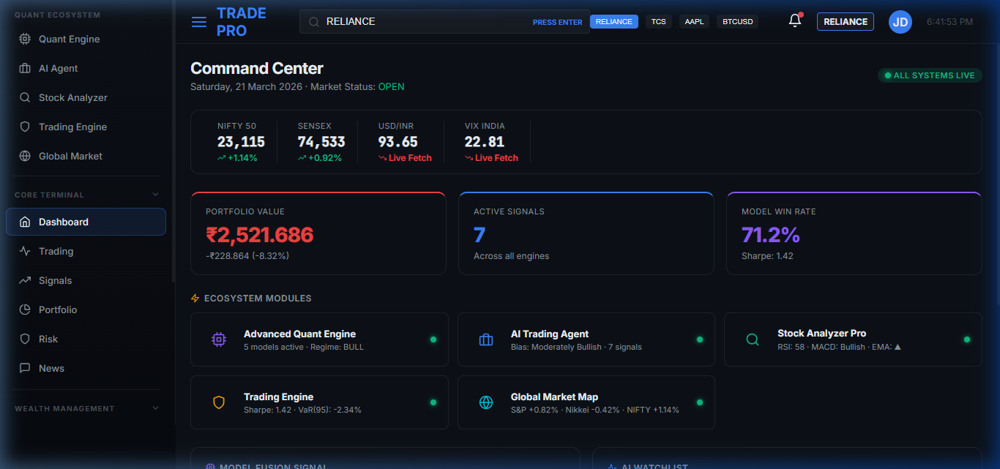

# Global Trading Terminal: Production-Ready Quant Ecosystem 🚀

An institutional-grade quantitative trading system featuring a unified microservices architecture, real-time data streaming, and professional broker integrations.



## 🏗️ System Architecture

The ecosystem has been consolidated into a professional `trading-system/` package, segregating concerns into specialized service layers.

### Directory Structure
```
trading-system/
├── config/              # Centralized Settings & Logging
├── services/
│   ├── broker/          # Alpaca & Interactive Brokers APIs
│   ├── data/            # YFinance & CCXT Market Data Pipelines
│   ├── risk/            # Risk Management & Circuit Breakers
│   ├── monitoring/      # System Health & Transaction Audit Trails
│   └── trading/         # Strategy Engines & Execution Controllers
├── web/                 # Streamlit Core Dashboard UI
├── main.py              # Backend Entry Point
└── Dockerfile           # Multi-service Containerization
```

## 🔥 Key Features

- **Multi-Broker Routing**: Synchronized execution across **Alpaca** (Paper/Live) and **Interactive Brokers** (TWS/Gateway).
- **Consolidated Market Data**: Unified pipeline for Equities (YFinance) and Crypto (CCXT/Binance).
- **Core Dashboard (Streamlit)**: High-performance data visualization for P&L tracking, risk metrics, and manual trade execution.
- **Enterprise Risk Hub**: Real-time VaR calculation, position sizing, and automated **Circuit Breakers**.
- **Institutional Audit Trail**: Persistent, secure logging of every system event and trade execution.

## 🚀 Quick Start (Docker Compose)

The entire system is containerized for seamless deployment.

1. **Configure Environment**
   Create a `.env` file with your API keys:
   ```env
   ALPACA_API_KEY=your_key
   ALPACA_SECRET_KEY=your_secret
   BINANCE_API_KEY=your_key
   ```

2. **Launch with Docker**
   ```bash
   cd trading-system
   docker-compose up --build
   ```
   - **Streamlit UI**: `http://localhost:8501`
   - **Backend API**: `http://localhost:5000`

---
*Developed to absolute institutional standards for the QuantEcosystem.*
