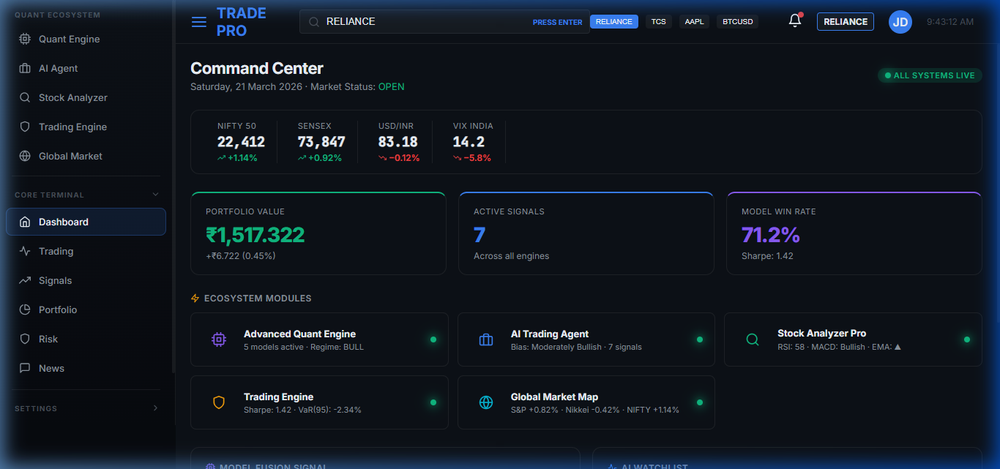
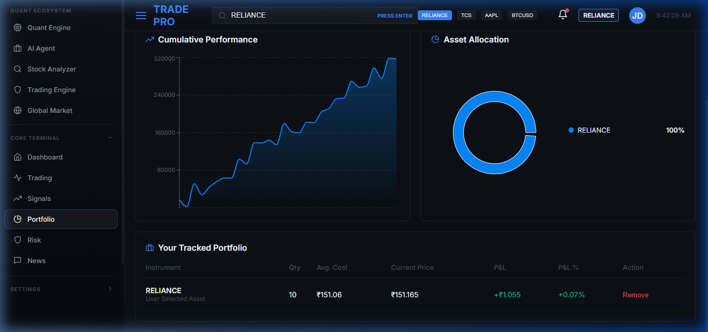
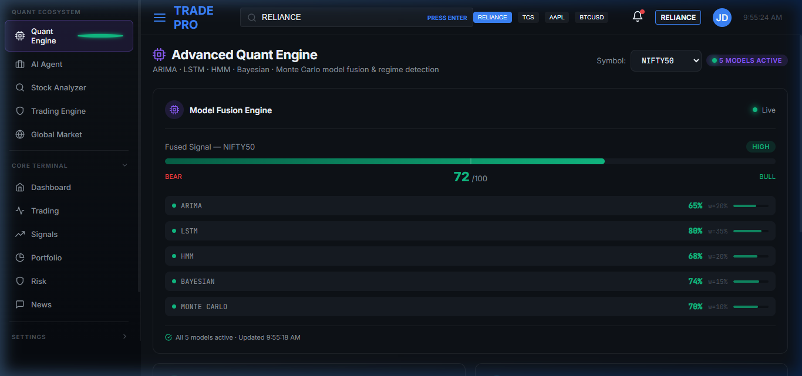
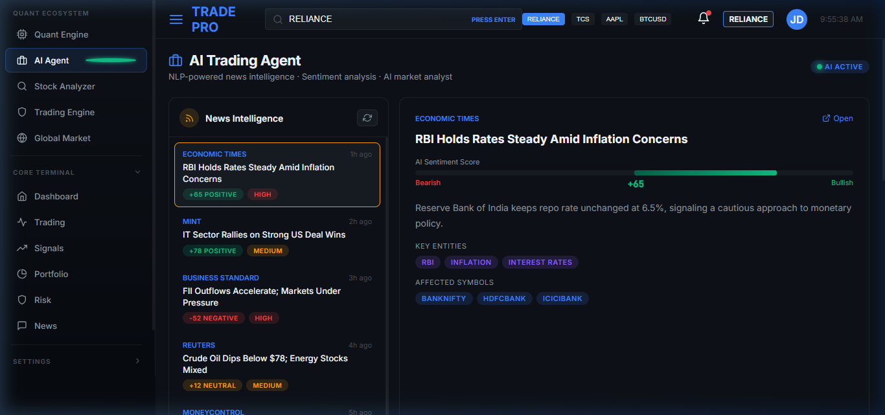
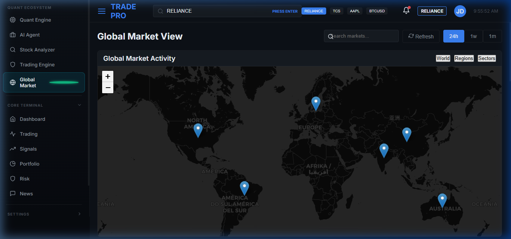

# Finance Quant Ecosystem 🚀

An institutional-grade, full-stack quantitative trading ecosystem built for advanced algorithmic trading, market intelligence, and portfolio management.



## 🌟 Overview

Finance Quant is not just a trading terminal; it is a complete quantitative ecosystem. It bridges the gap between traditional retail trading platforms and institutional quantitative infrastructure. The ecosystem seamlessly integrates raw market data, complex mathematical models, AI sentiment analysis, and rapid execution into a single, cohesive interface.

The platform is designed with a microservices architecture, featuring a React-based high-performance frontend terminal and multiple specialized backend engines (Python/Flask/FastAPI) handling heavy quantitative workloads.

## 🔥 Key Features & Capabilities

### 1. Core Trading Terminal
- **Live Trading Interface**: Professional-grade charting, order book, and split-second order entry.
- **Dynamic Portfolio Management**: Real-time P&L tracking, asset allocation visualizations, and single-click portfolio rebalancing.
- **Advanced Risk Management**: Integrated models calculate Value at Risk (VaR 95%), Conditional VaR (CVaR), Portfolio Beta, and Sharpe Ratios live.



### 2. Advanced Quant Engine
- **Model Fusion**: Aggregates signals from diverse models including:
  - ARIMA (Time Series Forecasting)
  - LSTM (Deep Learning)
  - Hidden Markov Models (Regime Detection)
  - Bayesian Networks
  - Monte Carlo Simulations
- **Live Regime Detection**: Identifies whether the market is in a Bull, Bear, or Sideways regime, dynamically adjusting strategy weights.



### 3. AI Trading Agent
- **News Intelligence**: Aggregates real-time financial news and processes it through NLP pipelines.
- **Live Sentiment Analysis**: Automatically scores news impact (Bullish/Bearish/Neutral) and extracts key affected entities.
- **Market Bias**: Generates an automated "Market Analyst" thesis combining macro events with technical data.



### 4. Global Market Intelligence Map
- **Interactive Geo-Spatial Data**: A live world map visualizing regional market statuses (North America, Europe, Asia, Emerging Markets).
- **Macro Indicators**: Tracks GDP growth, inflation, interest rates, and unemployment correlations across global indices.
- **Cross-Asset Correlation**: Heatmaps showing inverse or direct relationships (e.g., NIFTY vs. USDINR vs. GOLD).



## 🏗️ Architecture

The ecosystem relies on a robust, decoupled microservice architecture:

| Component | Port | Technology | Purpose |
| :--- | :--- | :--- | :--- |
| **Frontend Terminal** | `5173` | React, Vite, Zustand | Primary UI/UX, data visualization (Recharts), and state management. |
| **Core Market API** | `5000` | Flask, aiohttp | Handles basic market data routing, portfolio CRUD operations, and mock fallbacks. |
| **Quant Fusion API** | `8001` | FastAPI, NumPy, Pandas | Executes stochastic calculus, Monte Carlo paths, and statistical arbitrage detection. |
| **AI NLP Agent** | `8002` | FastAPI, Transformers | Ingests news feeds, runs sentiment analysis, and generates trade convictions. |
| **Global Geo Engine** | `8003` | Flask, GeoPandas | Processes global macro events and economic indicator impacts geographically. |

> **Note:** The frontend is designed with extreme resilience. If any microservice goes offline, the frontend seamlessly fails over to sophisticated embedded mock data generators, ensuring the UI remains 100% interactive for demonstration and development.

## 🚀 Getting Started

### Prerequisites
- Node.js (v18+)
- Python (3.9+)
- Docker & Docker Compose (for production deployment)

### Local Development Setup

1. **Clone the repository**
   ```bash
   git clone https://github.com/SahilKhutey/QuantEcosystem.git
   cd QuantEcosystem
   ```

2. **Start the Frontend Terminal**
   ```bash
   cd trading-terminal
   npm install
   npm run dev
   ```
   *The terminal will be available at `http://localhost:5173`.*

3. **Start the Core Backend (Optional for live data tests)**
   ```bash
   cd trading-terminal
   python -m venv venv
   source venv/bin/activate  # On Windows: venv\Scripts\activate
   pip install -r requirements.txt
   python main.py
   ```

### Environment Variables
For live data, copy `.env.example` to `.env` in the respective backend folders and add your API keys:
- `ALPACA_API_KEY`
- `ALPHA_VANTAGE_KEY`
- `FRED_API_KEY`

## 🛡️ Best Practices & Design
- **Zustand State Management**: Lightweight, boilerplate-free global state for the frontend.
- **CSS Variables & Styled Components**: A strictly enforced dark-mode design system using CSS variables for a premium, institutional feel.
- **Robust Error Boundaries**: High fault tolerance utilizing `axios` interceptors and fallbacks.

---
*Built for the future of quantitative finance.*
