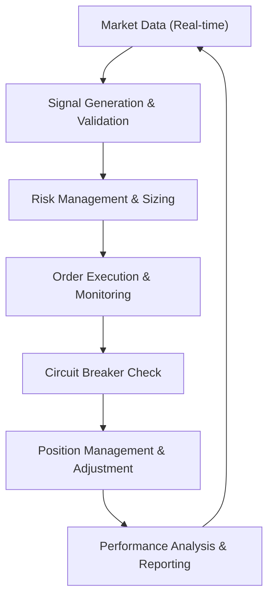

# Autonomous Trading Engine: Theory of Operations

This document describes the underlying architecture and autonomous workflow of the Quant Ecosystem's trading engine. The system is designed to execute institutional-grade strategies without human intervention while maintaining rigorous risk parity.

## 1. The Autonomous Workflow

The engine follows a cyclic, multi-stage pipeline from data ingestion to post-trade analysis.

### 1.1 Data Ingestion & Signal Generation
- **Real-time Ingestion**: Normalized feeds from Alpaca, IBKR, and TD Ameritrade.
- **Multimodal Strategy Logic**: 
    - **HFT**: Scalping based on order book imbalance.
    - **Swing**: Trend-following using daily crossovers.
    - **Intraday**: Session-locked breakout strategies.
- **Signal Validation**: Each signal is scored for confidence based on volume profile and volatility metrics.

### 1.2 Risk & Execution Guardrails
- **Pre-Trade Validation**: The `RiskManager` validates every order against:
    - Daily loss limits (5%).
    - Maximum account drawdown (15%).
    - Individual position allocation (10%).
- **Smart Order Routing**: Orders are pushed to the most liquid or cost-effective broker via the `GlobalBrokerRouter`.

### 1.3 Post-Trade Lifecycle
- **Position Monitoring**: Active trades are monitored for stop-loss or take-profit triggers.
- **Mandatory Closure**: The Intraday engine enforces a hard closure 15 minutes before the US market close to eliminate overnight risk.
- **Feedback Loop**: Performance metrics (Win Rate, Profit Factor) are calculated in real-time to update the `Global Trading Terminal`.

## 2. Core Autonomous Components

### 🛡️ Circuit Breaker System
Multiple layers of risk controls that trigger an automatic trading suspension if thresholds are breached, protecting capital during "flash crash" events or API instability.

### 📊 Position Management
Active management of open risk, including automated stop-loss adjustments and target execution based on real-time bid/ask spreads.

### 🌐 Global Routing
Abstraction of broker-specific complexities, allowing the autonomous engines to focus on Alpha generation while the router handles execution specifics for each API.

---
*Quant Ecosystem | Autonomous Trading Operations*
